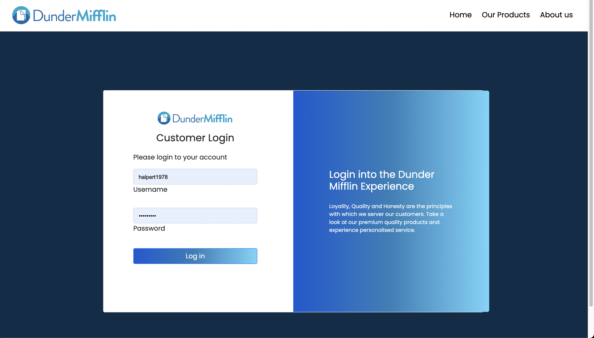
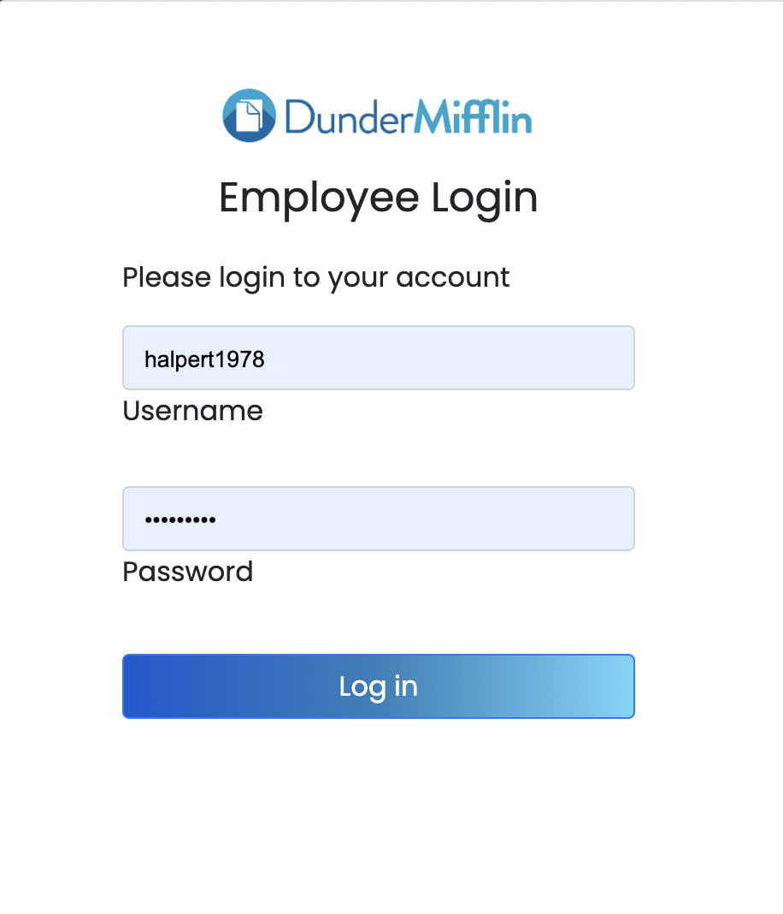
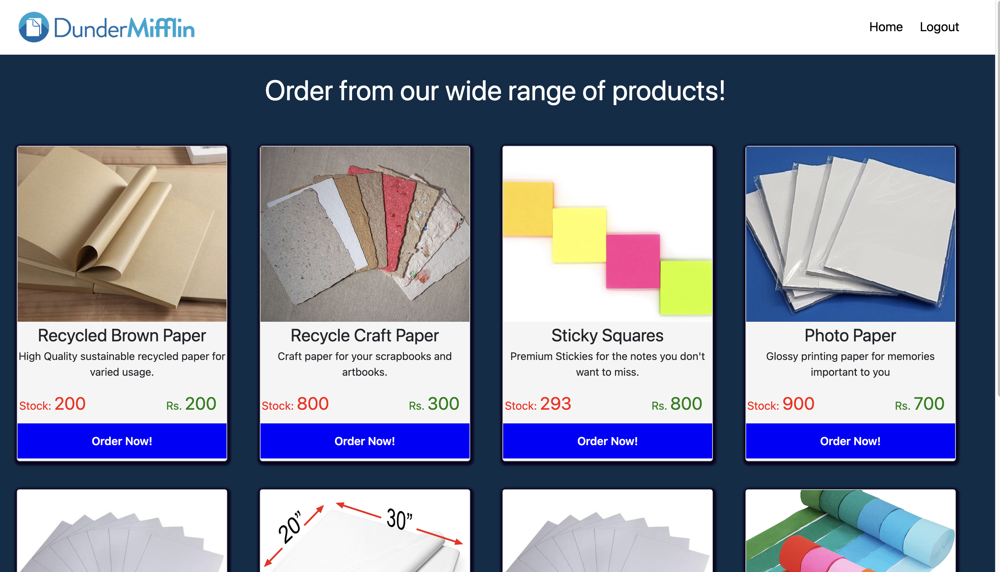
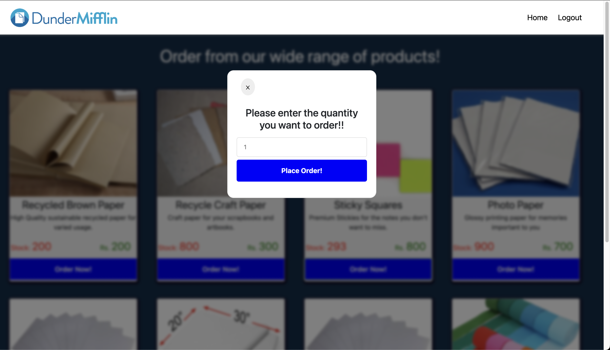
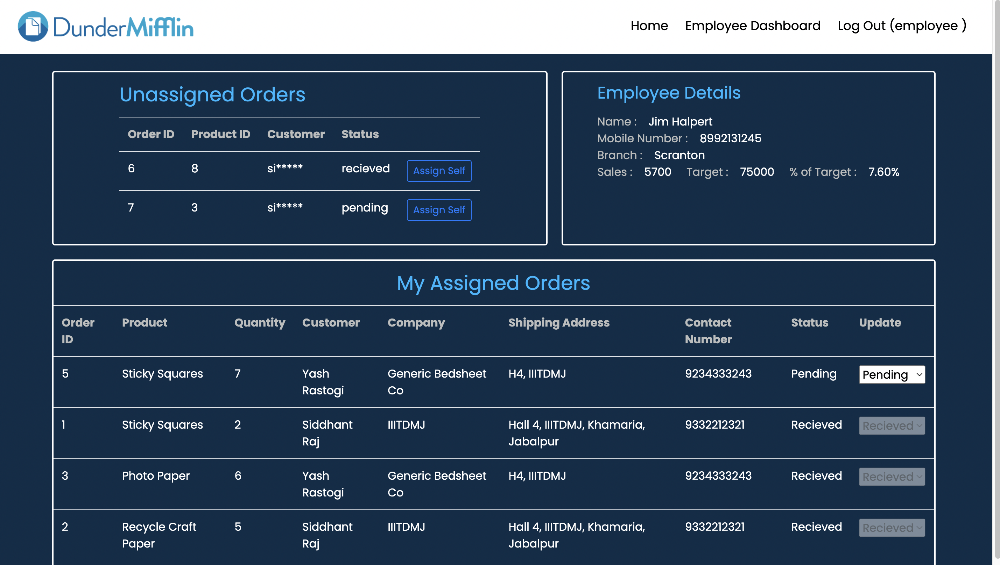
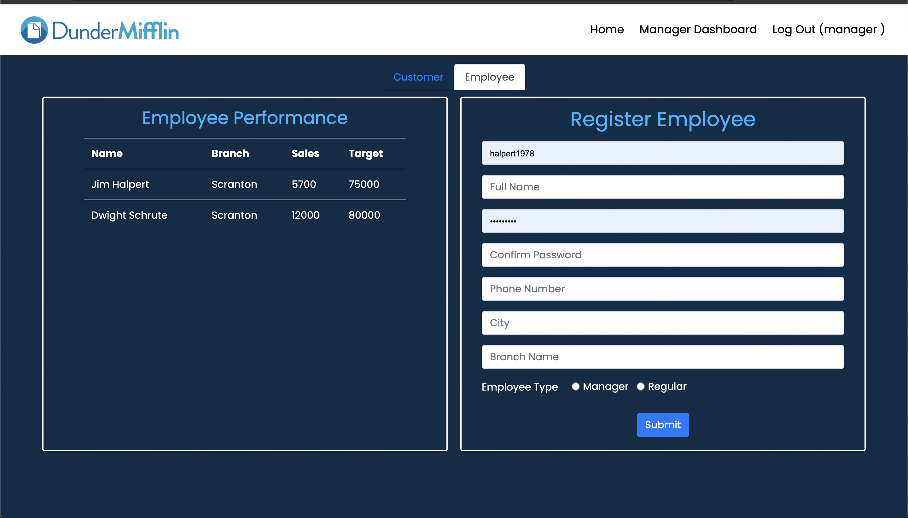
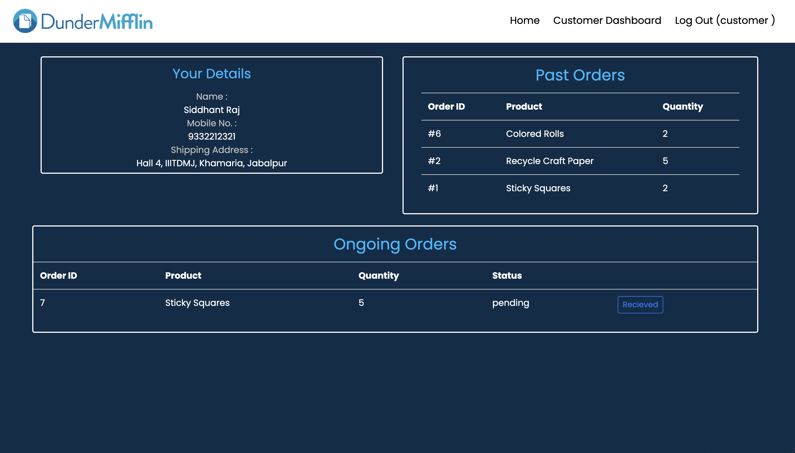

<h1 style="font-size: 50px; font-weight: 10px;" align="center"> The Dunder Mifflin Website
</h1>

---

<div align="center">
</img>
</div>


<div style="width: 100%; padding: 20px; text-align: center; font-size: 20px; margin-top: 30px;">


This is a project we made for our 'Database Management Systems' course and it includes several features required for management of daily office work at a small scale paper distributor(Dunder Mifflin!). Details are down below!
</div>

---
# <*> Features : 
## + Landing / Home page

<div style="width: 100%; padding: 20px; display: flex; flex-direction: column; justify-content: center;">


## + Sign In page for customers and employees

<div style="width: 100%; padding: 20px; display: flex justify-content: center; align: center">



</div>

## + Product Page 

<div style="width: 100%; padding: 20px; display: flex; flex-direction: column; justify-content: center;">



</div>


## + The Dashboards

 * Employee
  
    

 * Manager

    

 * Customer

    


----


# <*> Stuff we Used : 

<div style="width: 100%; display: flex; jusitfy-content: space-between;" >

<div style="width: 50%; text-align: center; border: thin solid white">
<span style="font-size: 20px;">Server: </span>

<p style="font-size: 13px;">
Express.js <br>
Templating Engine: EJS

</p>
</div>

<div style="width: 50%; text-align: center; border:thin solid white;">
<span style="font-size: 20px;">Database: </span>
<p style="font-size: 13px;">
MySQL<br>
PHPMyAdmin as console
</p>
</div>

</div>


## + Repo Structure

* Import the database from 'database' folder which contains database schema and different instances of database

* The backend folder has the server where: 
   - views: contains the EJS templates
   - routes: contains the express routes
   - controllers: contains the node modules for authorisation and session management etc

* use ```npm start``` to run the server in the backend folder

---

# <*> Impovements Possible: 

1. Multiple user handling
2. Online transactions for Ordering
3. Memes